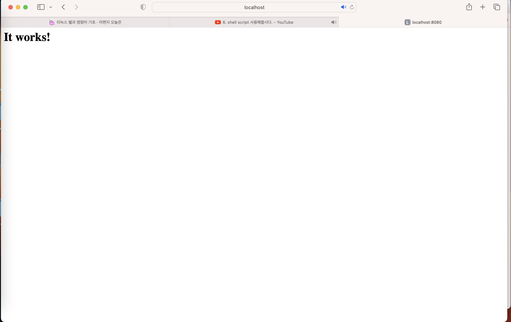

# Apache 통해서 웹서버 실행하기

Mac OS에서 사용

% apachectl -v
Server version: Apache/2.4.57 (Unix)
Server built:   Apr  6 2023 18:16:37
(base) ***-MacBookPro ~ % brew install apache2
Running `brew update --auto-update`...
==> Auto-updated Homebrew!
Updated 2 taps (homebrew/core and homebrew/cask).
==> New Formulae
gffread      hivex        jsmn         judy         ord          shush
==> New Casks
eset-cyber-security

You have 7 outdated formulae installed.

% apache2 -v
zsh: command not found: apache2
(base) ***@***-ui-MacBookPro ~ % arch -arm64 /bin/bash

The default interactive shell is now zsh.
To update your account to use zsh, please run `chsh -s /bin/zsh`.
For more details, please visit https://support.apple.com/kb/HT208050.
bash-3.2$ chsh -s /bin/zsh
Changing shell for ***.
Password for ***:

bash-3.2$ arch -arm64 /bin/bash

ash-3.2$ ip addr | grep inet

bash-3.2$ curl ipinfo.io/ip

bash-3.2$ brew install httpd

bash-3.2$ sudo apachectl start

