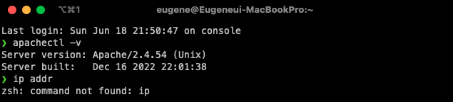
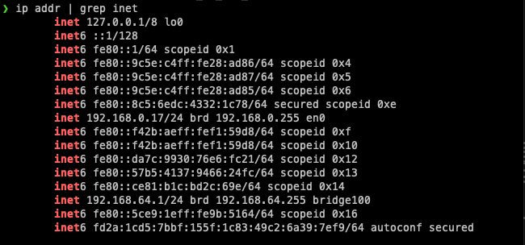
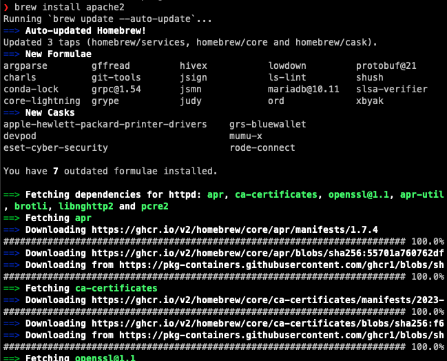
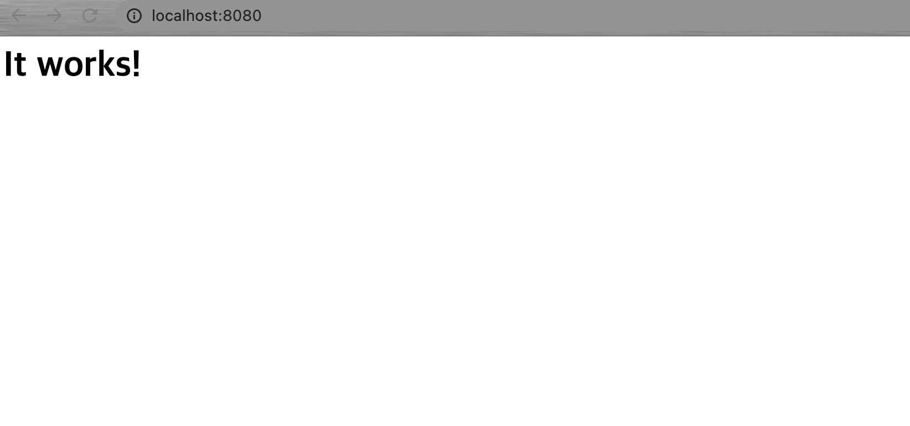
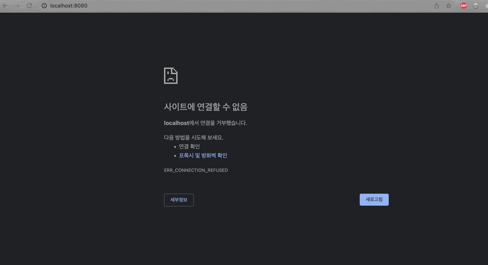
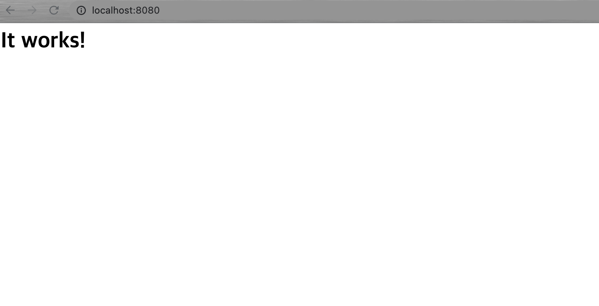

다른 사람들에게 나의 서버를 제공하고자 하면 첫 걸음으로는 IP주소를 안내하는 것이다.
IP주소를 알아내기 위해서 맥북에서 이런저런 세팅을 해보자.

## 1. 서버 ip 주소 알아내기 (2가지 주소 모두)
- 컴퓨터에 부여된 실제 ip 주소 출력 : `ip addr`
아쉽게도 해당 명령어가 바로 인식되지 않는다. 

해당 명령어를 인식시키기 위해서는 `iproute`를 설치해야 한다.
`yum` 패키지도 없으므로 homebrew를 이용하여 `iproute` 패키지를 설치해준다.

```
192.168.0.17
```

- 컴퓨터가 외부에 접속할 때 사용하는 ip 주소 출력 : curl ipinfo.io/ip 또는 ipinfo.io/ip 주소 직접 방문
```
116.37.74.102
```

## 2. 서버 컴퓨터에 웹 서버 설치하기
이미 `apache`가 깔려 있지만 brew를 통해서 다시 설치해주도록 합시다~


## 3. 웹 서버 설치 여부 확인하기 (2가지 방법 모두)
- 버전 확인 : `apache2 -v`


## 4. 웹 서버 실행/중지/재시작 해보기
`brew services start httpd` 명령어를 이용하여 웹서버를 실행할 수 있는 환경을 만들어줍니다. 이후, `sudo apachectl start` 명령어를 통해 웹서버를 실행합니다.

`sudo apachectl stop`을 입력하여 웹서버를 중단시키면 아래와 같은 화면입니다.

이제 재시작을 해볼까요? `sudo apachetil restart`을 입력합니다.
