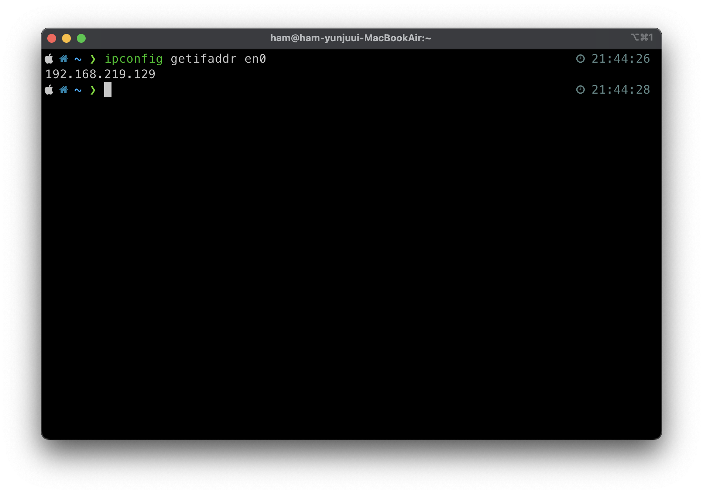
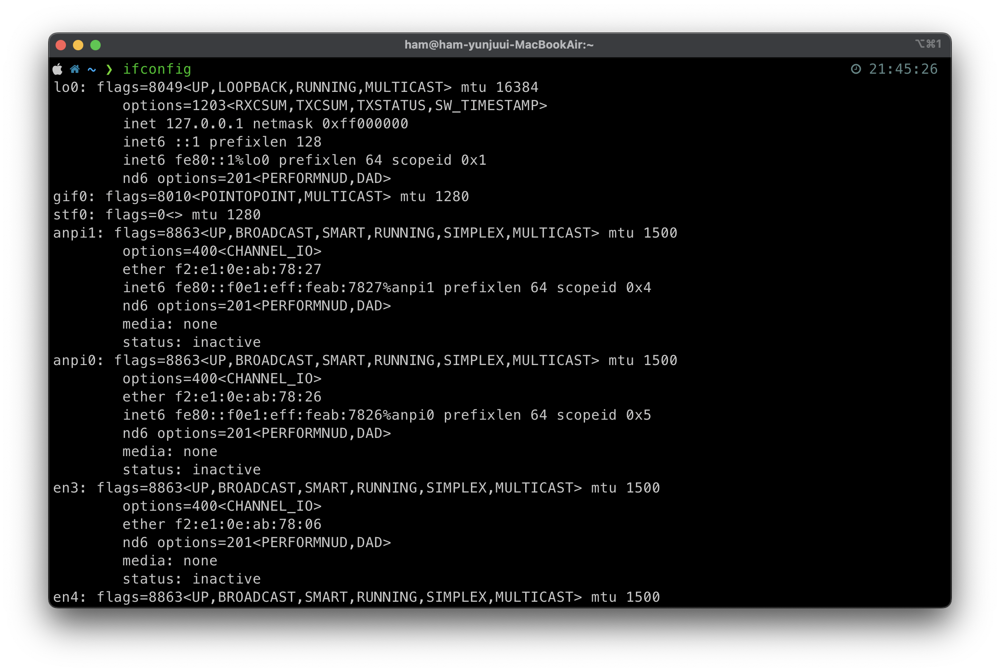
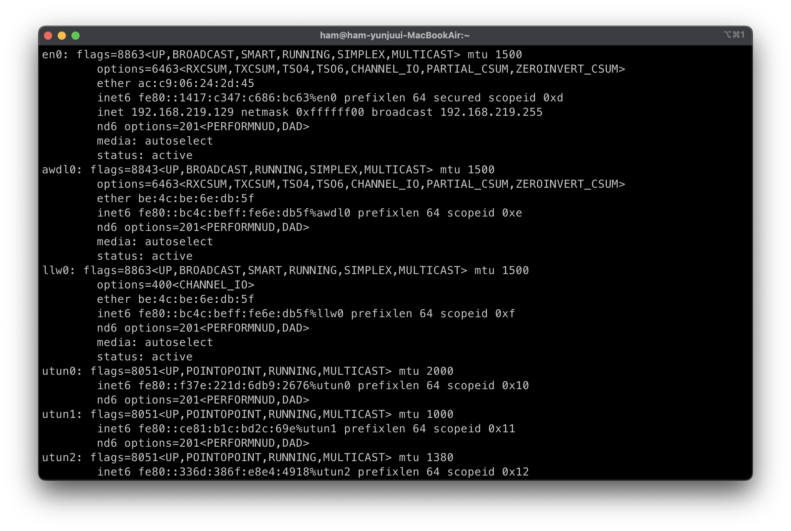
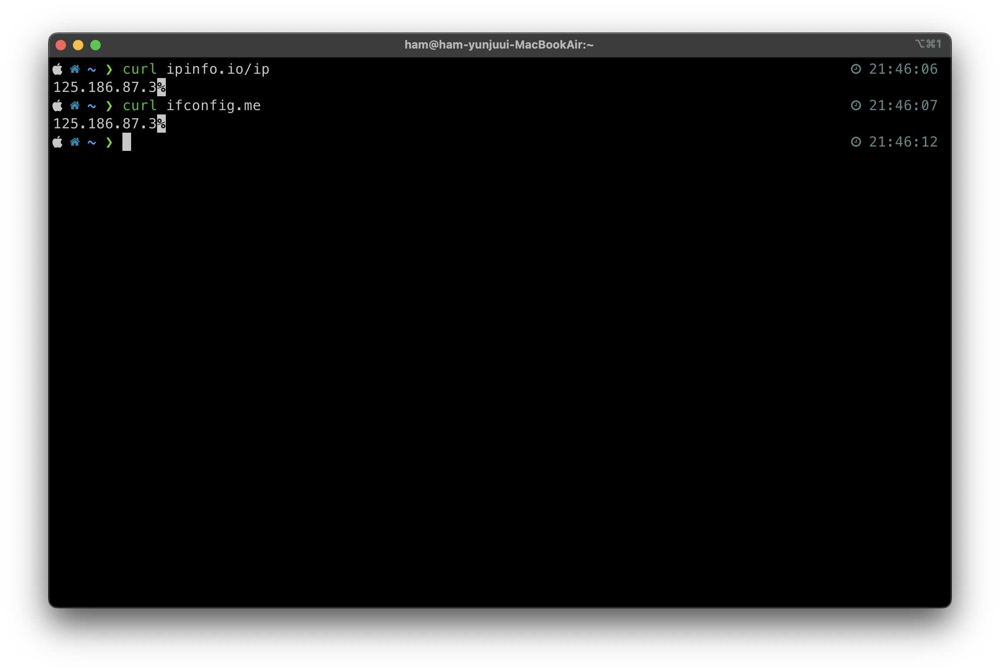
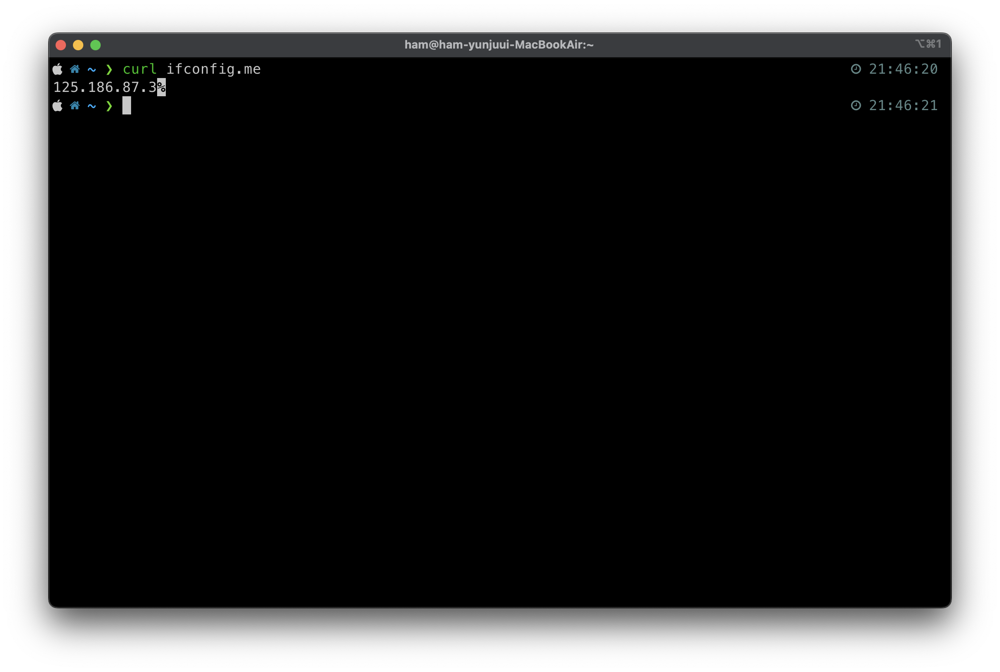
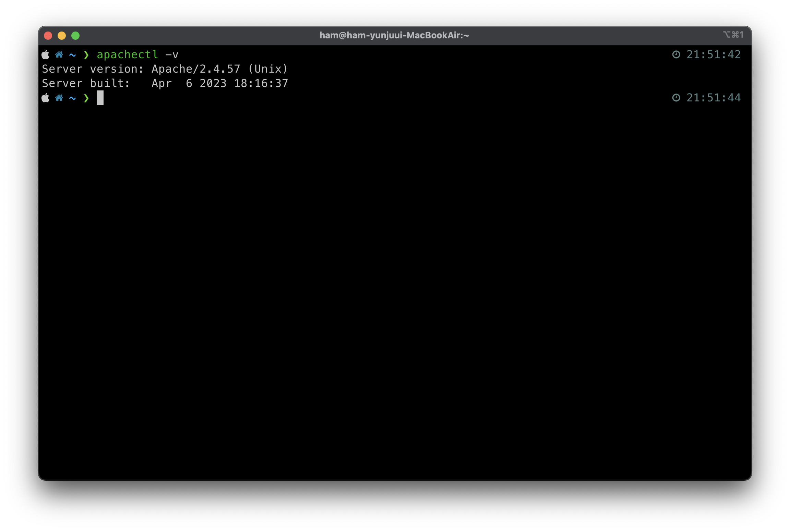
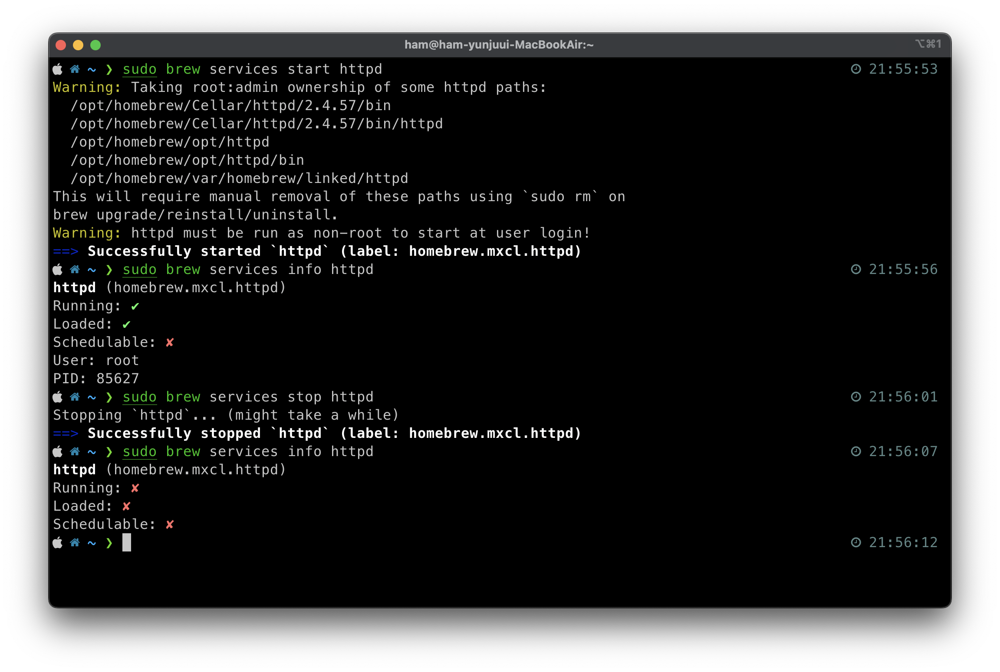

# Apache 서버 실행
🍏 `Zsh`쉘 (MacOS) 에서 명령어 실행해보기 !

## IP 주소 확인

### private IP
```bash
ipconfig getifaddr en0    # check private IP addr
```


#### 💡 `ifconfig` 명령어를 실행하면?

- interface configuration
- 내 컴퓨터의 모든 TCP/IP 네트워크에 대한 설정을 보여줌

- 그 중 `en0` 부분은 ethernet0에 해당하는 정보만 보여줌
- 여기서 확인할 수 있는 내 컴퓨터의 IP주소는 `192.168.219.219`
- private IP 주소임을 알 수 있음

#### 💡 `private IP` 주소란?
- 외부에서 연결할 수 없는, 내부 서브넷 안에서 사용하는 IP 주소
- 주로 학교나 기관, 집 안에서 사용
- 총 3가지 종류가 있음
    - `10.0.0.0/8`
    - `172.16.0.0/16`
    - `192.168.0.0/24`

### public IP
```bash
curl ipinfo.io/ip         # check public IP addr
curl ifconfig.me          # also works
```



## Apache 설치
- `brew` 명령어 사용 (homebrew 사전설치 필요)
```bash
brew install apache2

apachectl -v              # check apache server version
```



## Apache 서버 실행 / 중지 / 재시작
- `apachectl` 명령어 사용
```bash
sudo brew services start httpd      # start apache server
sudo brew services stop httpd       # stop apache server
sudo brew services restart httpd    # restart apache server
sudo brew services info httpd       # check apache server status
```


